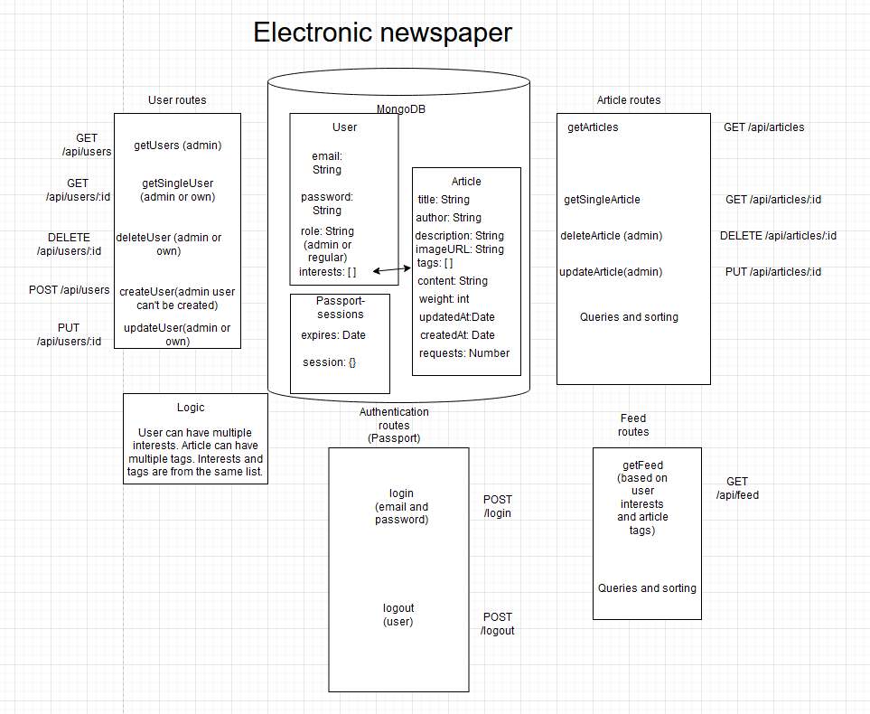

# newspaper-api
Newspaper API created with Express. App uses protected routes that require authentication and possibly admin privileges. Admin user is initialized on startup if it doesn't exist. User news feed is created based on user interests. 
